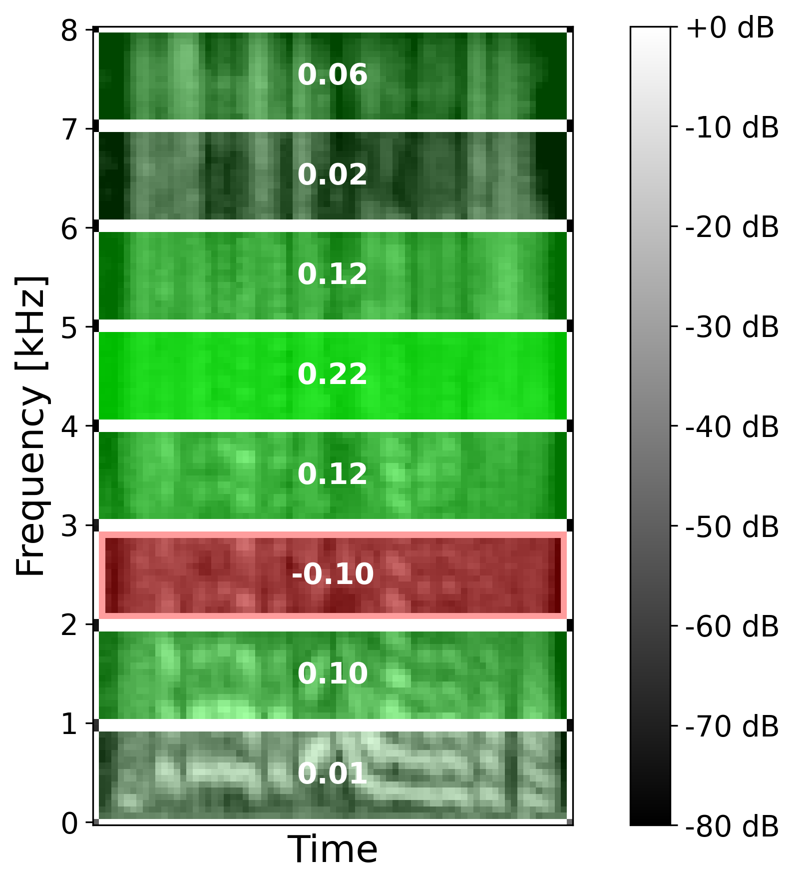
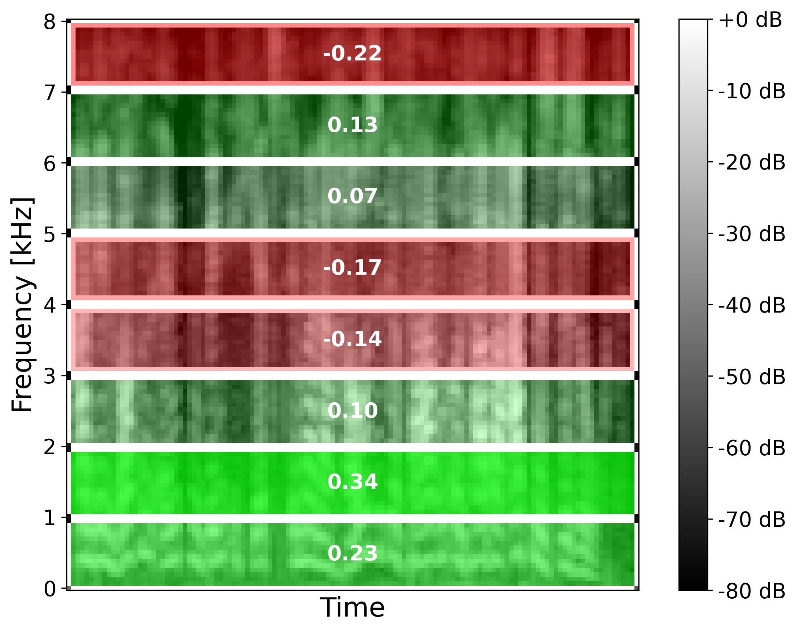

# EmoLIME

Codes and resource for the [ICASSP 2025](https://2025.ieeeicassp.org/) paper: [**"Exploring Local Interpretable Model-Agnostic Explanations for Speech Emotion Recognition with
Distribution-Shift"**](https://arxiv.org/abs/2504.05368).

## Overview

EmoLIME is a model-agnostic XAI technique to explain Speech Emotion Recognizers.
The implementation of EmoLIME builds on [CoughLIME](https://github.com/glam-imperial/CoughLIME) and the [LIME Python module](https://github.com/marcotcr/lime).

**Example explanations**

<div style="display: flex; justify-content: space-between; align-items: flex-start;">

  <div style="flex: 7; margin-right: 10px; text-align: center;">
    
    <p><strong>a)</strong> Happy explanation.</p>
  </div>

  <div style="flex: 10; margin-left: 10px; text-align: center;">
    
    <p><strong>b)</strong> Angry explanation.</p>
  </div>

</div>
<p style="text-align: center;"><strong>Figure 1:</strong> Example explanations for happy (a) and angry (b) expressions of German sentences from EMODB. 
Components highlighted in green account for a true prediction. Weights are annotated in white.
a) Higher weight is given to high-pitch sounds. b) More weight is given to low-pitch sounds.</p>

**Main conclusions**
- We introduce EmoLIME, a LIME-based XAI method for SER, and show that its explanations align well with human intuition.
- We evaluate EmoLIME qualitatively, quantitatively, and statistically on three emotional speech datasets using both hand-crafted features and Wav2Vec 2.0-based classifiers.
- We show that EmoLIME is more robust across models than across datasets with distribution shifts, supporting its utility for consistent within-dataset explanations.

Read more in [the paper](https://arxiv.org/abs/2504.05368).

## How to use

Follow these steps to reproduce the explanations in Figure 1.

Step 1) Clone the GitHub repo and install requirements
```bash
git clone https://github.com/snehadas/EmoLIME.git
cd EmoLIME/
pip install -r requirements.txt
```  
Step 2) Download the Berlin Database of Emotional Speech (EMODB).

Step 3) Run the script with the arguments
```bash
python main.py --filename 11b03Wa.wav --emotion angry --model w2v2_FT
```
Where `filename` specifies the path to the file and `model` specifies the SER model.
Two models, which classify four emotions: happy, angry, sad, and neutral, are provided:
1. `ComParE` SVC trained on ComParE hand-crafted features.
2. `w2v2_FT` SVC trained on embeddings from a fine-tuned Wav2Vec 2.0 model.

Step 4) Generate explanations using a custom SER model

To use EmoLIME with your own SER model and data, it requires a custom prediction function that output logits rather than class labels.
Refer to `main.py` to see how and where.

NB: To generate the components, five decompositions were originally provided in CoughLIME.
However, only spectral decomposition (splitting the audio array into equal components along spectral axis) is supported in EmoLIME.


## Citation

```
@inproceedings{hjuler_emolime_2025,
author = {Hjuler, Maja and Clemmensen, Line and Das, Sneha},
year = {2025},
month = {04},
pages = {1-5},
title = {Exploring Local Interpretable Model-Agnostic Explanations for Speech Emotion Recognition with Distribution-Shift},
doi = {10.1109/ICASSP49660.2025.10889825}
}
```